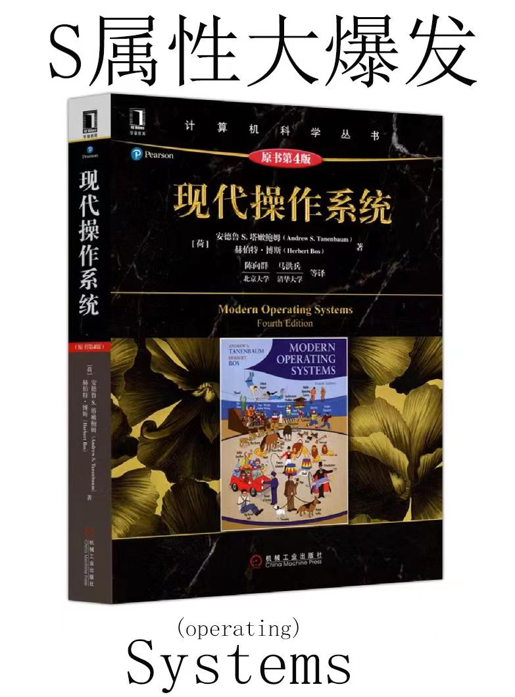

# GanshinFUSE

 

    

    

    
    
    

 

[简体中文](README_ZH.md)  | [English](README_EN.md) 

OS File System Based on FUSE.

 

~~**要是SCUTer看见了, 都是一个班, 抄了很容易被老师认为抄袭哦**~~

 

 

## 功能特性

- 利用FUSE框架创建一个SFS文件系统，这个文件系统采用inode方式管理文件系统
- 类似于UFS, 空闲块和空闲inode均采用位图的方式管理，文件数据块采用直接和间接索引的方式，支持多级目录。
- 为了方便实现，文件名格式为8.3，即文件名为8个字节，扩展名为3个字节。之后想办法实现长文件名。

 

## 文件结构(可选)

- doc => 存放开发文档

 

## 系统架构

Linux

 

## 快速开始

### 依赖检查

<!-- 描述该项目的依赖，比如依赖的包、工具或者其他任何依赖项 -->
 

### 构建

<!-- 描述如何构建该项目 -->
 

### 运行

<!-- 描述如何运行该项目 -->
 

## 使用指南

<!-- 描述如何使用该项目 -->
 

## 关于作者
keeser

 

## TODO（可选）

 
## 许可证

MPL 2.0
